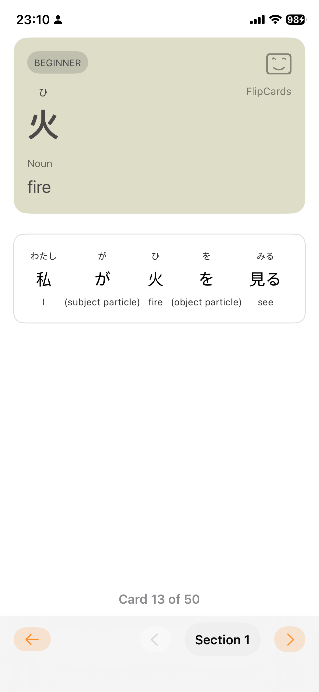
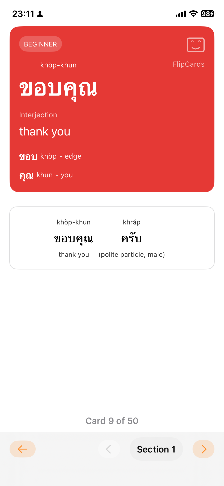
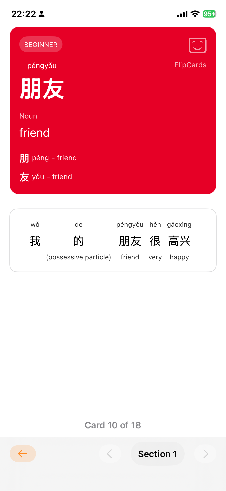
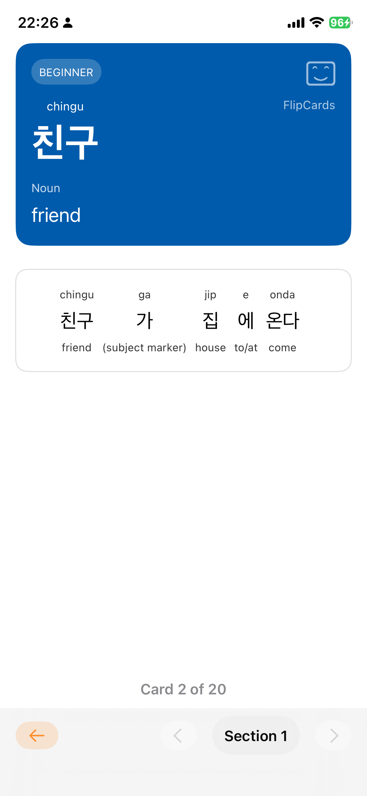
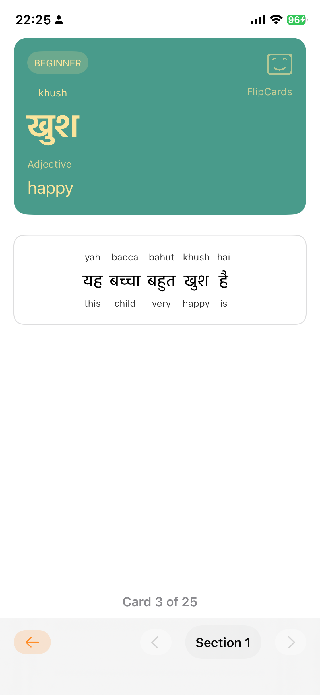
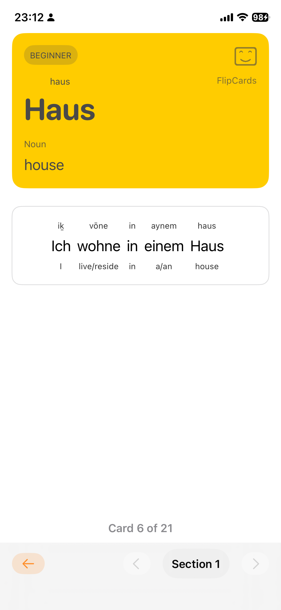
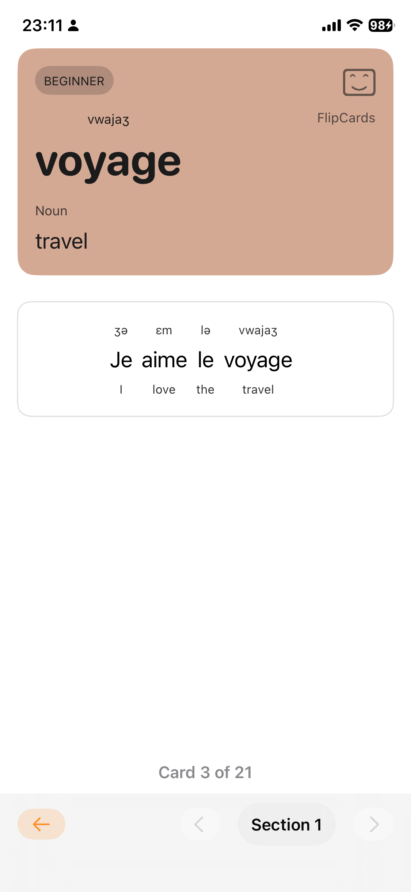
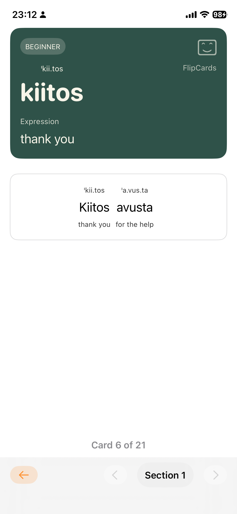

# 📘 FlipCards

**FlipCards** is a beautifully designed flashcard app that makes learning languages simple, intuitive, and enjoyable.  
Swipe, tap, and listen — FlipCards brings your vocabulary to life with rich visuals, native pronunciation, and smooth interactions.

<table>
  <tr>
    <th style="width:25%; text-align:center;">Japanese</th>
    <th style="width:25%; text-align:center;">Thai</th>
    <th style="width:25%; text-align:center;">Chinese</th>
    <th style="width:25%; text-align:center;">Korean</th>
  </tr>
  <tr>
    <td></td>
    <td></td>
    <td></td>
    <td></td>
  </tr>
</table>

 

<table>
  <tr>
    <th style="width:25%; text-align:center;">Hindi</th>
    <th style="width:25%; text-align:center;">German</th>
    <th style="width:25%; text-align:center;">French</th>
    <th style="width:25%; text-align:center;">Finnish</th>
  </tr>
  <tr>
    <td></td>
    <td></td>
    <td></td>
    <td></td>
  </tr>
</table>

---

## ✨ Features

- 🃏 **Interactive Flashcards** — Swipe left or right to navigate cards effortlessly.  
- 🔊 **Built-in Pronunciation** — Tap on any card or sentence to hear native speech, even in silent mode.  
- 🌍 **Multilingual Support** — Supports Japanese, Finnish, Thai, Chinese, and more.  
- 🧠 **Smart Layout** — Automatically adjusts font size and layout to fit any screen.   
- 🧩 **Dynamic Content** — Learn Kanji, vocabulary, and grammar with structured sample sentences.  

---

## 🎨 Designed for Learners

FlipCards combines minimalism with interactivity.  
Every element — from the flashcard colors to the rounded card edges — is crafted to create a calm and motivating study atmosphere.

---

## 🔮 Coming Soon

- More languages
- More interactive features
- To reach 2000 words for each language 

---

## 📱 Availability

**FlipCards** is available on the **App Store** for iPhone and iPad.  
Stay tuned for updates and new language packs.

---

## 👤 Developer

Created by **Thiha Aung**  
[LinkedIn](https://www.linkedin.com/in/kothihaaung)  
[X (Twitter)](https://x.com/leothihaaung)

---

> *“Learning a new language should feel as smooth as flipping a card.”*  
— *FlipCards Team*
